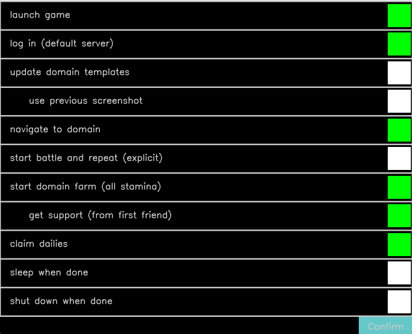
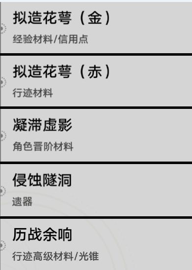
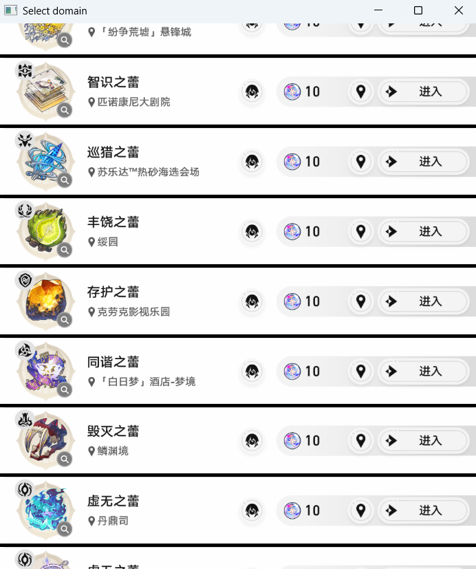

# Macro_Automation
A simple macro for automating tasks.

Features **template-based automation**, **resilient error handling**, and **interactive GUI**.

Currently focused on automating Honkai: Star Rail (HSR) game.

---

## Getting Started

### Requirements
- **Python 3.10+** installed  
- **Windows OS** environment (tested on Windows 10/11)  

---

### Installation

```bash
git clone https://github.com/stanX19/Macro_Automation.git Macro_Automation
cd Macro_Automation
py -m pip install -r requirements.txt
```

---

### Running

```bash
cd srcs
set PYTHONPATH=%CD%\..\srcs;%CD%\classes;%CD%\UI;%CD%\Data_manager;%CD%\utils;%CD%\hsr;%CD%\hsr\generate_templates;%PYTHONPATH%
py hsr\star_rail_main.py
```

---


## Features

### Template Matching

- Multi-Scale Resizing
- Region of Interest (ROI) clamping
- Optional Binary Preprocessing (Canny, Gaussian)
- Matching threshold customization
- Smart caching per frame to accelerate detection
- Timeout-backed wait loops for dynamic UI

The system uses **`Matcher`** and **`StatusMatcher`** classes to monitor templates dynamically.

---

### Robust Code Design

- Custom Exceptions: (`GameConnectionError`, `ScreenCaptureFailedError`, etc.)
- Safe Screenshot Wrapping
- Advanced Logger supporting both File + Console logging
- Modular class-based architecture for easy extensibility
- Optimized mouse controls for UI interaction

---

## HSR Automation

### Interactive GUI
Allows selection of tasks like launching game, logging in, farming domains, claiming dailies, etc.

|          Selecting options           |             Select category              |              Select Domain               |
|:------------------------------------:|:----------------------------------------:|:----------------------------------------:|
|  |  |  |

#### Precise Logging
Automated, timestamped logging with elapsed time calculations for performance tracking:
```commandline
[00:00:26]: INFO:HSR_Macro:launch_game: ok
[00:01:23]: INFO:HSR_Macro:log_in_to_game: completed
```

---


## Modules

| Folder                      | Purpose |
|-----------------------------|---------|
| **srcs/classes/**           | Core helpers: Logger, Template Matching, Status Tracking, Exception Definitions |
| **srcs/Data_manager/**           | Paths and global settings configuration |
| **srcs/genshin/**                | Genshin-specific macro workflows |
| **srcs/hsr/**                    | Honkai Star Rail automation: login, domain farming, dailies, navigation |
| **srcs/hsr/generate_templates/** | Long screenshots, segmentation, domain template generation |
| **srcs/UI/**                     | Lightweight GUI interfaces: image selector, option selector |
| **srcs/utils/**                  | General utilities: file ops, mouse operations, decorators, path helpers |

---

## Technology Stack

| Component | Tech |
|-----------|------|
| Language | **Python 3.10+** |
| GUI Toolkit | **Tkinter**, **PIL (Pillow)** |
| Image Processing | **OpenCV** |
| Input Automation | **pyautogui**, **mouse**, **keyboard** |
| Logging | **Python’s logging**, custom extended |
| Project Structure | Modular + Extensible with full OOP principles |

---

## Architecture Overview

```plaintext
srcs/
├── classes/                  # Core logic: template matching, status tracker, custom exceptions
├── Data_manager/             # Settings (json), path configurations
├── genshin/                  # Genshin-specific macro flows
├── hsr/                      # HSR-specific macro flows
│   └── generate_templates/   # Domain image capture & segmentation
├── UI/                       # Interactive GUI modules
├── utils/                    # Helper functions, decorators, file utilities
└── temp/                     # Temporary files and experiments
```

Each game module (HSR or Genshin) builds on the **common classes** and **utils**, following **dependency inversion** and **high cohesion** principles.

---

## License

Distributed for educational purposes only.  
All rights to the original games belong to their respective developers.
